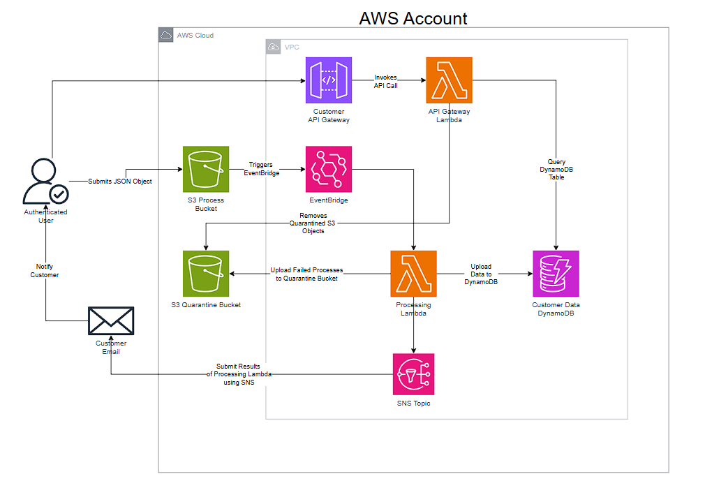

# Project Architecture

This document outlines the architecture to be implemented in the project. The diagram for the proposed architecture is shown below.

# Requirements
-

# Functionality
In addition to the requirements, we must identify user functionalities:
-

# Architecture Breakdown
**Components**

*S3*
-

*EventBridge*
-

*Lambda*
-

*DynamoDB*
-

*SNS*
-

*API Gateway*
-

***Excluded from diagram***

*IAM*
-

# Benefits

# Downsides
