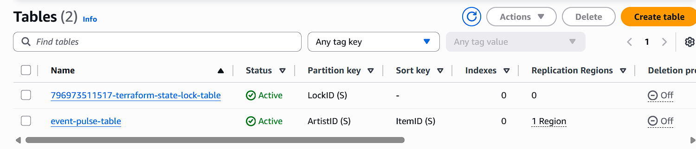
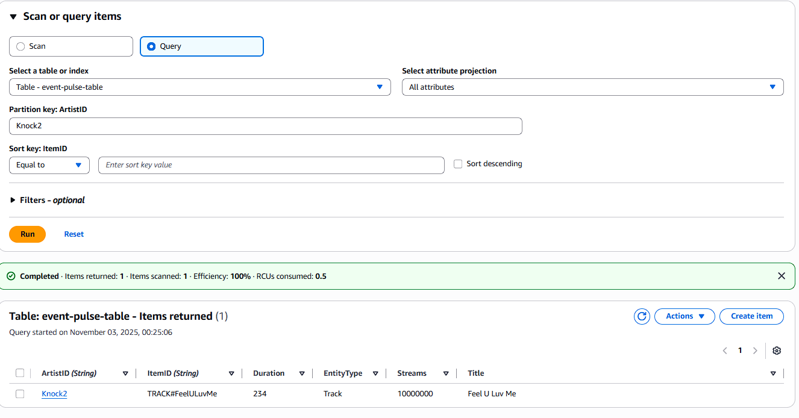
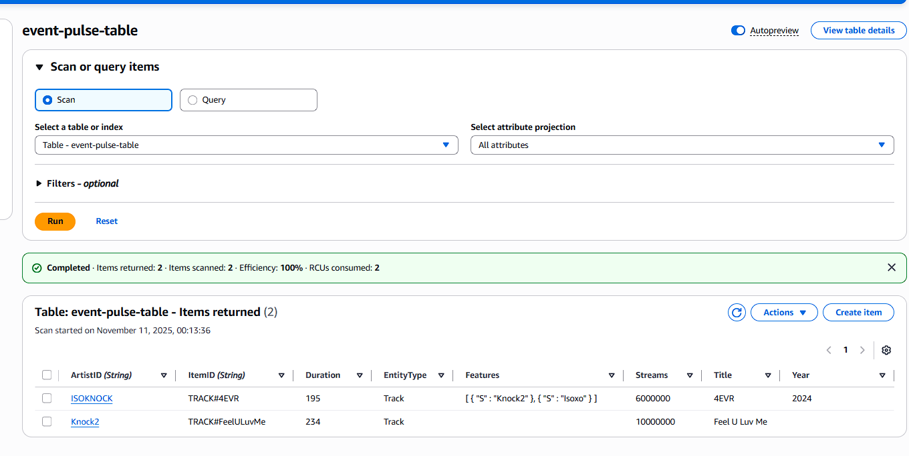
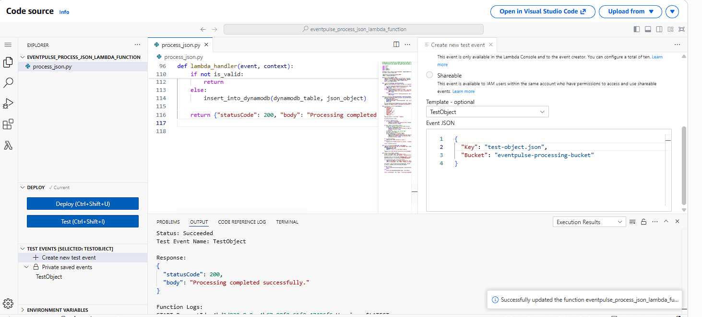
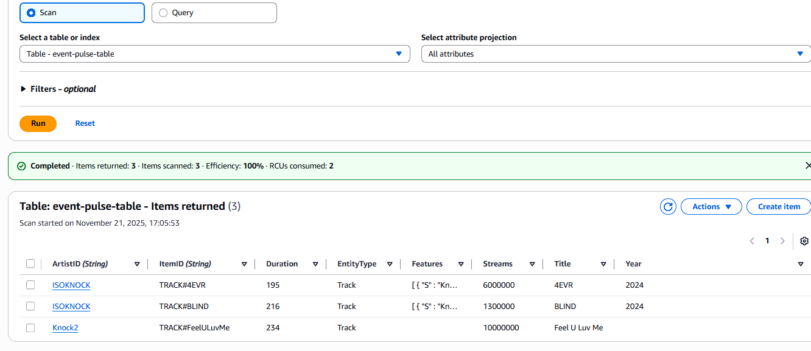
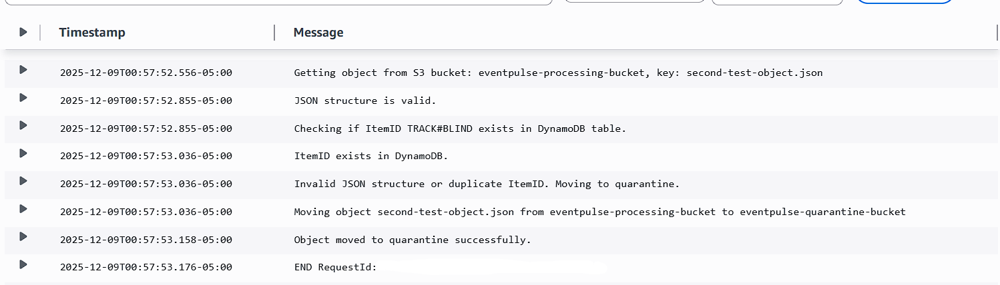
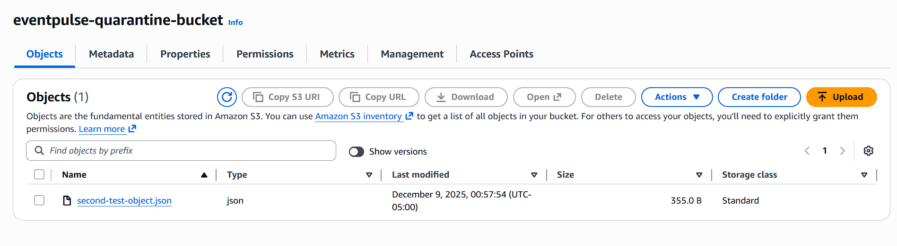
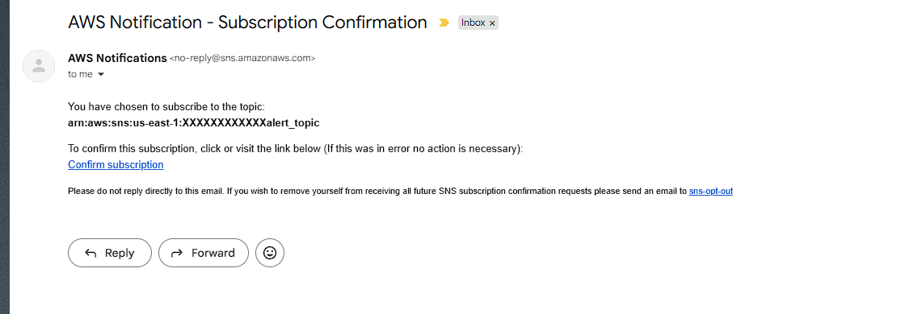
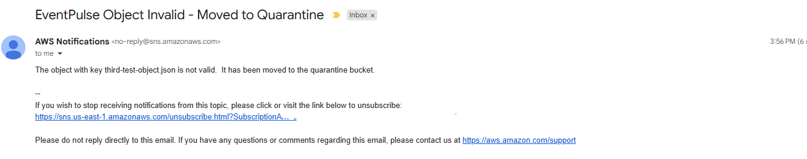
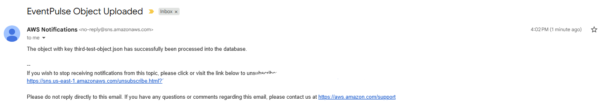

# S5 - Secure Static Simple Storage Service

### Created and Written By - Justin Ng
### Started: September 12, 2025
### Completed: TBD

# Process Documentation

## Initial Improvements
In my previous project [s5](https://github.com/jcng75/s5), I was not satisfied with the way that the backend configuration was setup.  Doing some research, I found that optimizations could be made using a `backend.conf` file.  Shown in the [README.md](../../README.md), the state file can be initialized referencing the created file.  Additionally, I added a `terraform.tfvars` file, allowing values to be customized outside the created terraform code.  Both files are limited to the user, as they were included within the `.gitignore` file.

## Terraform
In addition to the initial improvements, I wanted to change the way I handled the creation of resources.  I believe that various components depended on each other, and that affected the whole development process.  I want to start by creating the components that don't have dependencies first (i.e S3, DynamoDB, etc.).  From there, the components that require them can be build on using them as dependencies.  Additionally, IAM policies should be reconfigured last.  In the beginning, services will be granted access greater than they are needed, but will be adjusted to support the principle of least privilege.  This will improve the speed to begin the foundation of the terraform configurations.

### S3

Initial creation of the buckets was simple to follow.  Using the terraform.tfvars file, I created an object variable for each bucket that needed to be created.  For the `force_destroy` argument, it has been set to default but for the project I configured the value to be **true**.

```
# terraform.tfvars

quarantine_bucket = {
  name = "eventpulse-quarantine-bucket"
  region = "us-east-1"
  force_destroy = true
}

```

One interesting behavior I noticed was when I set the name of both buckets to be the same (i.e eventpulse-processing-bucket).  When running the terraform applies, only **one** of the buckets was created with providing an error.  Updating the quarantine bucket name caused the individual S3 bucket to get replaced.  To fix this problem, I ran `terraform state list` to get the resources and tained both of them.

```
# Confirm the resouces in state
terraform state list
aws_s3_bucket.processing_bucket
aws_s3_bucket.quarantine_bucket

# Taint the resources
terraform taint aws_s3_bucket.processing_bucket
terraform taint aws_s3_bucket.quarantine_bucket

# Rerun the apply
terraform apply
```

After the buckets were created, I added configurations to each bucket.  I first updated the buckets to have configurations for [versioning](https://registry.terraform.io/providers/hashicorp/aws/latest/docs/resources/s3_bucket_versioning).  This was done by adding to the variables.  A validation check needed to be added to verify that the string added was a valid argument value.  

From there, an [S3 bucket policy](https://registry.terraform.io/providers/hashicorp/aws/latest/docs/resources/s3_bucket_policy) was created for each bucket.  For this part of the project, security was configured to allow full access for any principals within the AWS account.  This will be revisited later when we focus on hardening security.

### DynamoDB

When starting work on DynamoDB, I learned a lot with how the service worked.  The first thing I needed clarification on was when I tried to standup the [aws_dynamodb_table](https://registry.terraform.io/providers/hashicorp/aws/latest/docs/resources/dynamodb_table) resource.  Reading through the documentation, it was a little unclear on how the `hash_key` and `range_key` were used.  Based on my research, the hash key acts as a unique identifier if the range key does not exist.  In other terms, this can be considered the primary key in NoSQL databases.  If the range key **was** included into the table, the hash key **no longer** has to be unique.  One example of this can be having a person ID as the hash key and a `dateCreated` as a range key.

Upon learning this information, it was clear to me that our requirements were not sufficient enough to proceed with the project.  In doing so, I went back to the [index.md](../architecture/index.md) to establish JSON requirements for what users can submit to the S3 bucket.  In this case, we wanted to simulate music data, whether it be a song or album from an artist.  In doing so, this led me to decide the hash_key as `ArtistID` and the sort_key as `ItemID`.  The ItemID had to be unique, so it follows this naming convention:
```
"EntityType#Title"
```
The `EntityType` would be either Track or Album.  For example, the hash key and range key could look like this:
| ArtistID | ItemID |
|:---------|:-------:|
| Knock2 | TRACK#FeelULuvMe |

There are also additional attributes that can be added to the row entry.  In this project, I plan on adding the following attributes:
- Features
- Duration (seconds)
- Streams
- EntityType
- Title

It should be noted that these attributes do NOT need to get added into the terraform resource.  Since DynamoDB is schemaless, only indexes and keys need to be defined.  The rest can vary per item.  This makes sense as we may not need certain attributes like `Features` for a specific song or album.

When discovering this, the logic on attributes needed to be updated.  Since the hash_key is always required but the range_key is not, a conditional was set for both the attribute block and the `range_key` argument.

When running the initial apply, I ran into the following error:

```
│ Error: creating AWS DynamoDB Table (event-pulse-table): replicas: creating replica (us-east-2): operation error DynamoDB: UpdateTable, https response error StatusCode: 400, RequestID: XXXXXXXXXXXXXXXXXXX, api error ValidationException: Table write capacity should either be Pay-Per-Request or AutoScaled.
```

Upon doing further reading, it was explained that autoscaling must be enabled to use provisioned for the `billing_mode`.  This would involve the `aws_appautoscaling_target` resource and defining scaling policies for each target.  To circumvent this, I went with setting the billing mode to `PAY_PER_REQUEST`.  This also led me to removing the capability to add read/write capacity.

`DynamoDB Screenshot Completion:`



To verify that the table was functioning as intended, I ran the following command:
```
aws dynamodb put-item \
  --table-name event-pulse-table \
  --item '{
    "ArtistID": {"S": "Knock2"},
    "ItemID": {"S": "TRACK#FeelULuvMe"},
    "Duration": {"N": "234"},
    "Streams": {"N": "10000000"},
    "EntityType": {"S": "Track"},
    "Title": {"S": "Feel U Luv Me"}
  }'
```
When running this command, it is important to note the --item flag takes in a map as input.  This map must be proper JSON, and takes a **String** as input being converted to a JSON object.  Additionally, each argument inputted must take the attribute as the Key and `{"DATATYPE": "VALUE"}` as the value (see [documentation](https://docs.aws.amazon.com/cli/latest/reference/dynamodb/put-item.html) for more information).  Due to these circumstances, single quotes were used around the map object and double quotes were used within the string.

`DynamoDB Verification Screenshot:`



### JSON Processing (Python)

The next step of the project that I started to work on was the JSON processing lambda script.  Before starting, I wanted to configure the script to be able to test locally.  Boto3 is a required Python3 library for this project.  

Ran the following commands:
```
python3 -m venv .venv
source .venv/bin/activate
pip install boto3
```

The objective of this script was to read from the event, verify the JSON structure, and insert the data into DynamoDB.  If the structure was invalid, the object would be moved to the quarantine bucket.  We first needed to add an object into the S3 processing bucket to simulate the event that would trigger the lambda function.  As a result, `test-object.json` was created within the `scripts/process_json` directory.  The content of the file is as follows:

```
{
  "ArtistID": {
    "S": "ISOKNOCK"
  },
  "ItemID": {
    "S": "TRACK#4EVR"
  },
  "Duration": {
    "N": "195"
  },
  "EntityType": {
    "S": "Track"
  },
  "Streams": {
    "N": "6000000"
  },
  "Title": {
    "S": "4EVR"
  },
  "Features": {
    "L": ["Knock2", "Isoxo"]
  },
  "Year": {
    "N": "2024"
  }
}
```

When building the script, I learned more about the [get_object](https://boto3.amazonaws.com/v1/documentation/api/latest/reference/services/s3/client/get_object.html) method from the boto3 S3 client.  The response object returns a `body` attribute that is of type [StreamingBody](https://botocore.amazonaws.com/v1/documentation/api/latest/reference/response.html).  This object has a `read()` method that returns the bytes of the object.  From there, I was able to decode the bytes into a string and load it as a JSON object.

```
python3 process_json.py
INFO:root:Getting object from S3 bucket: eventpulse-processing-bucket, key: test-object.json
INFO:root:{'ArtistID': {'S': 'ISOKNOCK'}, 'ItemID': {'S': 'TRACK#4EVR'}, 'Duration': {'N': '195'}, 'EntityType': {'S': 'Track'}, 'Streams': {'N': '6000000'}, 'Title': {'S': '4EVR'}, 'Features': {'L': ['Knock2', 'Isoxo']}, 'Year': {'N': '2024'}}
```

The next step was to verify the structure of the JSON object.  Based on the requirements, the following attributes are required:
- ArtistID
- ItemID
Additionally, I wanted to make sure that no extraneous attributes were included.  To do this, I created a dictionary that defined the expected attributes and their data types.  The script would iterate through each key in the JSON object and verify that it existed in the expected structure.  If any required attributes were missing, an error would be logged and the object would be marked as invalid.
Finally, the script would check that the data types of each attribute matched the expected types.  Based on how the JSON object is structured, each attribute is a dictionary with a single key representing the data type (e.g., "S" for string, "N" for number, "L" for list).  The script would compare the data type key in the JSON object against the expected type from the structure dictionary.

The final step was to insert the valid JSON object into DynamoDB.  Using the [put_item](https://boto3.amazonaws.com/v1/documentation/api/latest/reference/services/dynamodb.html#DynamoDB.Table.put_item) method from the boto3 DynamoDB resource, the item was inserted into the table.  If the structure was invalid, the object would be moved to the quarantine bucket using the [copy_object](https://boto3.amazonaws.com/v1/documentation/api/latest/reference/services/s3/client/copy_object.html) method followed by a [delete_object](https://boto3.amazonaws.com/v1/documentation/api/latest/reference/services/s3/client/delete_object.html) method to remove it from the processing bucket.

When running the script, the following output was observed:
```
ERROR:root:Error checking quarantine: An error occurred (404) when calling the HeadObject operation: Not Found
```
It seems that the logic to check if the object already exists in the quarantine bucket is not functioning as intended.  Upon further inspection, I realized that the `head_object` method raises a `ClientError` exception when the object does not exist.  To fix this, I updated the exception handling to catch `ClientError` and check for a 404 error code.

Another problem I was having was with the list data type for the `Features` attribute.  Initially, I was trying to verify the data type by checking if the value was of type `list`.  However, in DynamoDB, lists are represented as a dictionary with a single key "L" containing a list of values.  What I did not realize was that the values within the list also needed to be in DynamoDB format.  For example, a list of strings should be represented as:
```
"Features": {
  "L": [
    { "S": "Knock2" },
    { "S": "Isoxo" }
  ]
}
```

To fix this, I updated the test JSON object and reuploaded the object to the S3 processing bucket.  After running the script again, the output was as follows:

```
INFO:root:Checking if object test-object.json is in quarantine bucket: eventpulse-quarantine-bucket
INFO:root:Object not found in quarantine.
INFO:root:Getting object from S3 bucket: eventpulse-processing-bucket, key: test-object.json
INFO:root:JSON structure is valid.
INFO:root:Inserting item into DynamoDB table: event-pulse-table
INFO:root:Item inserted successfully into DynamoDB.
```

`DynamoDB Table Result Screenshot:`



### JSON Processing (Terraform Lambda)

The next step was to package the Python script as a Lambda function and deploy it using Terraform.  To do this, I followed the [Terraform documentation](https://registry.terraform.io/providers/hashicorp/aws/latest/docs/resources/lambda_function.html#basic-function-with-nodejs) referencing the `process_json.py` script.  When looking over the documentation, I noticed that the Lambda role was missing additional policies to allow access to S3 and DynamoDB.  To fix this, I created three `aws_iam_role_policy_attachment` resources to attach the necessary policies to the Lambda role:
- AmazonDynamoDBFullAccess
- AmazonS3FullAccess
- AWSLambdaBasicExecutionRole
At this moment, I am aware that these policies are too permissive and will be revisited later to implement the principle of least privilege.

When configuring the Lambda function, I wanted to avoid manually creating a zip file for deployment.  To do this, I utilized the [archive_file](https://registry.terraform.io/providers/hashicorp/archive/latest/docs/data-sources/file) data source to automate the packaging of the Python script.  This data source takes in the path to the `process_json.py` file and creates a zip archive that can be referenced in the Lambda function resource.  After running the applies, I verified that the Lambda function was created successfully in the AWS Management Console.  After removing the test code from the script, I re-packaged and updated the lambda function.  By surprise, the script worked as intended without any issues.

`Lambda Function Screenshot:`


### EventBridge

The next step of the project was to create an EventBridge rule to trigger the Lambda function when a new object is created in the S3 processing bucket.  To do this, I utilized the [aws_cloudwatch_event_rule](https://registry.terraform.io/providers/hashicorp/aws/latest/docs/resources/cloudwatch_event_rule) resource to create the rule.  The event pattern was configured to match S3 `PutObject` events for the specific bucket.  For this project, I used the default event bus.

When doing initial testing, I did not run into terraform apply errors.  However, when uploading a new object to the S3 processing bucket, the Lambda function was not being triggered.  After doing some research, I realized that an additional permission was needed to enable EventBridge notifications onto the S3 bucket. To fix this, I updated the s3.tf configuration file creating the [s3_bucket_notification](https://registry.terraform.io/providers/hashicorp/aws/latest/docs/resources/s3_bucket_notification) resource.

In adding my configurations, I was able to get the lambda function to trigger successfully.  To verify this, I created a new JSON object `second-test-object.json` and uploaded it to the S3 processing bucket.  The content of the file is as follows:

```
{
  "ArtistID": {
    "S": "ISOKNOCK"
  },
  "ItemID": {
    "S": "TRACK#4EVR"
  },
  "Duration": {
    "N": "216"
  },
  "EntityType": {
    "S": "Track"
  },
  "Streams": {
    "N": "7500000"
  },
  "Title": {
    "S": "BLIND"
  },
  "Features": {
    "L": [
      { "S": "Knock2" },
      { "S": "Isoxo" }
    ]
  },
  "Year": {
    "N": "2025"
  }
}
```

The following log was observed in CloudWatch Logs for the Lambda function:
```
{'version': '0', 'id': 'a0fa2f4f-a1e0-2b71-3324-1b0464e62a0a', 'detail-type': 'Object Created', 'source': 'aws.s3', 'account': 'xxxxxxxxxxxx', 'time': '2025-11-21T21:24:12Z', 'region': 'us-east-1', 'resources': ['arn:aws:s3:::eventpulse-processing-bucket'], 'detail': {'version': '0', 'bucket': {'name': 'eventpulse-processing-bucket'}, 'object': {'key': 'second-test-object.json', 'size': 354, 'etag': 'xxxxxxxxxxxxxxxxxxxxxxx', 'version-id': 'b7YcjgV4OVh5TAr2ed3RyXG73F_Zh78j', 'sequencer': 'xxxxxxxxxxxxxx'}, 'request-id': 'xxxxxxxxxxxxxx', 'requester': 'xxxxxxxxxxxxxxx', 'source-ip-address': 'xxx.x.xxx.xx', 'reason': 'PutObject'}}
```

This led me to updating the lambda function code to process the new object.  After debugging, I realized that the ItemID value was incorrect.  The value was set to `TRACK#4EVR` instead of `TRACK#BLIND`.  This highlighted an issue with testing to ensure that unique values were being used.  After updating the value, I re-uploaded the object to the S3 processing bucket.  In doing so, I saw successful processing within the DynamoDB table.

`DynamoDB Table Result Screenshot:`


In the previous explanation, I explained that there was an issue with testing unique values.  To fix this, I updated the `process_json.py` script to check if the ItemID already exists in the DynamoDB table before inserting a new item.  This was done by creating a new function `check_dynamodb_table` that utilizes the `get_item` method from the boto3 DynamoDB client.  If the item exists, the function returns True, indicating that the ItemID is a duplicate.

`Lambda Duplicate ItemID Logs Screenshot`


`Object Result Screenshot:`


### SNS

The next step of the project was to implement SNS notifications to alert users when an object succeeds or fails during the lambda processing.  To do this, I created an SNS topic using the [aws_sns_topic](https://registry.terraform.io/providers/hashicorp/aws/latest/docs/resources/sns_topic) resource.  Additionally, I created an email subscription using the [aws_sns_topic_subscription](https://registry.terraform.io/providers/hashicorp/aws/latest/docs/resources/sns_topic_subscription) resource.  The email address used for the subscription is defined in the `terraform.tfvars` file.  When running the applies, I received a confirmation email to subscribe to the topic.  It should also be noted that the SNS topic policy allowed lambda functions to publish messages to the topic.  Based on the architecture, the lambda function would be responsible for sending notifications based on the processing outcome.

`SNS Subscription Confirmation Screenshot:`


The next step was to update the `process_json.py` script to send notifications to the SNS topic.  To do this, I created a new function `publish_sns_message` that utilizes the `publish` method from the boto3 SNS client.  The function takes in the SNS topic ARN, message, and subject as parameters.  Within the lambda handler, I added calls to this function at various points to send notifications based on the processing outcome (i.e., object already in quarantine, object invalid and moved to quarantine, object successfully uploaded).

When testing the new functionality, I created the third object `third-test-object.json` and uploaded it to the S3 processing bucket.  Upon uploading, I saw the following error in the lambda logs:

```
[ERROR] AuthorizationErrorException: An error occurred (AuthorizationError) when calling the Publish operation: User: arn:aws:sts::xxxxxxxx:assumed-role/eventpulse_process_json_lambda_role/eventpulse_process_json_lambda_function is not authorized to perform: SNS:Publish on resource: arn:aws:sns:us-east-1:xxxxxxxx:eventpulse_sns_alert_topic because no identity-based policy allows the SNS:Publish action
```

When checking my terraform configurations, I realized that while I had granted permissions for lambda to publish to the SNS topic, I had not granted permissions to the lambda **role** itself.  To fix this, I created a new `aws_iam_role_policy_attachment` resource to attach the `AmazonSNSFullAccess` policy to the lambda role.  After running the applies, I re-uploaded the object to the S3 processing bucket.  Again, the policy will be revisited later to implement the principle of least privilege.

After the lambda function executed, I received the following email notifications:

`SNS Original Error Screenshot:`


`SNS Notification Screenshot:`


### Python Utilities - S3 Upload

Based on the [Architectural Diagram](../architecture/index.md), authenticated users should be able to upload JSON objects directly to the S3 processing bucket.  To facilitate this, I created a new Python script `s3_upload.py` within the `scripts/s3_upload` directory.  This script utilizes the boto3 S3 client to upload a specified JSON file to the S3 processing bucket.  The reason for for creating this utility was to simulate user uploads without creating a web frontend.  If we were to create a web frontend, a static website could be hosted on S3 with a simple HTML form to upload files.  However, this would require additional configurations for authentication and security.

While working on this utility, I had to update the architectural diagram to reflect that the S3 upload would be done via a Python script instead of a web frontend.  This change was made to simplify the implementation while still meeting the requirement of authenticated user uploads.  The user would still need to have valid AWS credentials to run the script, ensuring that only authenticated users can upload files to the S3 processing bucket.  That user would then be able to assume the necessary IAM role to gain access to the S3 bucket.  In a real world scenario, this could be done using AWS Cognito or another authentication service.

Here were the results of the uploads:

```
# Using file that doesn't exist
python3 ./s3_upload.py upload_files/bogus.json
File not found: upload_files/bogus.json
Path upload_files/bogus.json does produce a JSON file.

# Using file that exists but is not a JSON file
python3 ./s3_upload.py upload_files/test.txt
Path upload_files/test.txt does produce a JSON file.

# Using valid JSON file
python3 ./s3_upload.py upload_files/test-object.json
Successfully uploaded upload_files/test-object.json to s3://eventpulse-processing-bucket/test-object.json
```

### IAM - Assumed Role Terraform Standup

For the script itself, in testing the Admin credentials were being used.  Now that the script is functioning as intended, IAM policies can be updated to enforce the principle of least privilege.

To start, I created an IAM user for the authenticated user using the [aws_iam_user](https://registry.terraform.io/providers/hashicorp/aws/latest/docs/resources/iam_user) resource.  The user name is defined in the `terraform.tfvars` file.  Next, I created an IAM policy using the [aws_iam_policy](https://registry.terraform.io/providers/hashicorp/aws/latest/docs/resources/iam_policy) resource.  This policy grants the necessary permissions for the user to upload files to the S3 processing bucket.  The policy document is defined using the [aws_iam_policy_document](https://registry.terraform.io/providers/hashicorp/aws/latest/docs/data-sources/iam_policy_document) data source.

Finally, I attached the policy to the user using the [aws_iam_user_policy_attachment](https://registry.terraform.io/providers/hashicorp/aws/latest/docs/resources/iam_user_policy_attachment) resource.  After running the applies, I verified that the user was created successfully in the AWS Management Console and that the policy was attached correctly.

### Python - IAM Improvements

The next step was to update the `s3_upload.py` script to use the new IAM role credentials.  To do this, I updated the script to assume the IAM role using the [assume_role](https://boto3.amazonaws.com/v1/documentation/api/latest/reference/services/sts.html#STS.Client.assume_role) method from the boto3 STS client.  As I was deveoping the script, I realized that the code being used would be reusable for future utilities.  As a result, I created a new sub-directory `utilities` within the `scripts` directory.  From there, I created a new sub-directory `s3_upload` to house the `s3_upload.py` script.  This structure allows for easy organization and future expansion of utility scripts.

When testing the updated script, I noticed that I received an error due to stating the Module could not be found.  This was due to my misunderstanding of how Python handles module imports.  After doing more research, I realized that the `s3_upload.py` script couldn't be run directly if it was importing from a parent directory.  This could be circumvented by treating each directory as a module.  To do this, I added an empty `__init__.py` file in each directory within the path.  This allows Python to recognize the directories as modules and resolve the imports correctly.  After doing so, I ran the script again and it functioned as intended.

Sucessful Upload Output:
```
Successfully uploaded utilities/s3_upload/upload_files/pr_cheerleader.json to s3://eventpulse-processing-bucket/pr_cheerleader.json
```

To ensure that this was documented, I updated the [README.md](../../scripts/README.md) file to include instructions on how to use the `s3_upload.py` script.  This includes information on the required parameters, how to set up the environment, and examples of usage.

### Python Utilities - S3 Quarantine Tool
The next utility script that I worked on was the S3 Quarantine Tool.  This script is designed to manage quarantined objects in the S3 quarantine bucket.  The script supports commands to list and delete quarantined objects.  Similar to the S3 Upload utility, this script assumes an IAM role to gain access to the S3 bucket.

A similar process was taken when creating the `s3_quarantine_tool.py` script.  The directory was created under `utilities/`, and the file was used as a module.  The terraform outputs file needed to then be updated to include the quarantine bucket ARN.  Using that information, the script's configuration section was updated to include the quarantine bucket and IAM role ARN that was assumed.

When writing the functions, I learned more about boto3 exception handling.  The `head_object` method raises a `ClientError` exception if the object doesn't exist.  I noted that the error code was "404" after running the script.  After adding a check for this exception, the script was able to handle non-existent objects gracefully.

The remove_quarantined_object function was implemented using the check_quarantined_object function to verify the object's existence before attempting deletion.  If the object exists, the `delete_object` method from the boto3 S3 client is used to remove it from the quarantine bucket.  A guardrail was added to ensure the user confirms the deletion before proceeding.

When testing the script, I didn't run into any issues with the boto3 commands.

Successful Object Check:
```
python3 -m utilities.s3_quarantine_tool.s3_quarantine_tool check test-object.json
Object test-object.json exists in bucket eventpulse-quarantine-bucket.
```

Successful Object Deletion:
```
python3 -m utilities.s3_quarantine_tool.s3_quarantine_tool check test-object.json
Are you sure you want to remove object test-object.json from bucket eventpulse-quarantine-bucket? (yes/no): yes
Successfully removed object test-object.json from bucket eventpulse-quarantine-bucket.
```

Failed Object Check (post removal):
```
python3 -m utilities.s3_quarantine_tool.s3_quarantine_tool check test-object.json
Object test-object.json does not exist in bucket eventpulse-quarantine-bucket.
```
